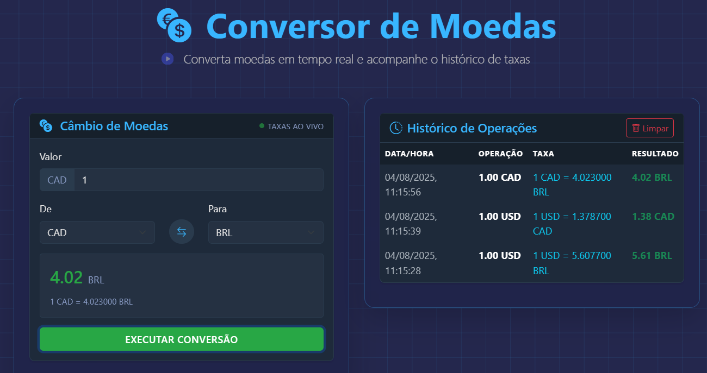

# Conversor de Moedas 💱


Um conversor de moedas moderno desenvolvido com React e Bootstrap, com uma interface inspirada em plataformas de trading. Permite converter entre diferentes moedas com taxas ao vivo da ExchangeRate-API, mantém histórico de operações e exibe gráficos de evolução das taxas.

---
## 🎥 Preview



<p align="center">
  <a href="https://currency-converter-nf.vercel.app/"><strong>➥ Live Demo</strong></a>
</p>


## 🚀 Funcionalidades

- ✅ Conversão entre mais de 30 moedas internacionais
- ✅ Interface dark mode estilo trading/financeiro
- ✅ Taxas de câmbio atualizadas em tempo real via ExchangeRate-API
- ✅ Histórico das últimas 10 operações
- ✅ Gráfico de evolução das taxas com Chart.js
- ✅ Persistência local dos dados de conversão via LocalStorage
- ✅ Design totalmente responsivo com Bootstrap
- ✅ Indicação visual do status do mercado
- ✅ Botão de inversão de moedas

## 🛠️ Tecnologias Utilizadas

- **Front-end:**
  - 
  - 
  - 
  - 

- **Back-end:**
  - 
  - 

- **Armazenamento:**
  - 

- **Princípios Aplicados:**
  - Componentização React
  - Hooks (useState, useEffect, useRef)
  - Armazenamento local (localStorage)
  - Design responsivo
  - Tema customizado para plataformas financeiras

### Componentes Principais

- **CurrencyConverter**: Responsável pela interface de conversão de moedas
- **ConversionHistory**: Exibe e gerencia o histórico de operações
- **ConversionChart**: Renderiza gráficos da evolução das taxas de câmbio
- **API Service**: Gerencia as chamadas para obtenção das taxas de câmbio da ExchangeRate-API

## 🖥️ Como Executar

1. Clone o repositório:
```bash
git clone https://github.com/felipe-ssantos/currency-converter.git
```

2. Navegue até o diretório do projeto:
```bash
cd currency-converter
```

3. Instale as dependências:
```bash
npm install
```

4. Configure a chave da API:
```bash
# Crie um arquivo .env na raiz do projeto
REACT_APP_EXCHANGE_RATE_API_KEY=sua_chave_aqui
```

5. Inicie o servidor de desenvolvimento:
```bash
npm start
```

6. Acesse a aplicação em seu respectivo [http://localhost](http://localhost)

## 🔄 Fluxo de Operação

1. Selecione a moeda de origem no campo "De"
2. Escolha a moeda de destino no campo "Para"
3. Digite o valor a ser convertido
4. Visualize o resultado da conversão instantaneamente
5. Clique em "EXECUTAR CONVERSÃO" para registrar a operação no histórico
6. Acompanhe a evolução das taxas no gráfico gerado automaticamente com Chart.js

## 💻 Compatibilidade

- Chrome 60+
- Firefox 55+
- Safari 11+
- Edge 80+
- Dispositivos móveis com navegadores modernos

## 📱 Layout Responsivo

A aplicação é totalmente responsiva e se adapta a diferentes tamanhos de tela:

- **Desktop**: Layout completo com todos os componentes lado a lado
- **Tablet**: Reorganização dos componentes para melhor visualização
- **Mobile**: Interface otimizada para telas pequenas com foco na usabilidade

## 🔒 Dados e Privacidade

- Todas as conversões são armazenadas apenas localmente (localStorage)
- Nenhum dado pessoal é enviado para servidores externos
- As taxas de câmbio são obtidas da ExchangeRate-API de forma segura

## 🤝 Contribuição

Contribuições são bem-vindas! Para contribuir:

1. Faça um fork do projeto
2. Crie uma branch para sua feature (`git checkout -b feature/nova-funcionalidade`)
3. Commit suas mudanças (`git commit -m 'Adiciona nova funcionalidade'`)
4. Push para a branch (`git push origin feature/nova-funcionalidade`)
5. Abra um Pull Request

## 📝 Licença

Este projeto está licenciado sob a Licença MIT - veja o arquivo [LICENSE](LICENSE) para detalhes.

---
